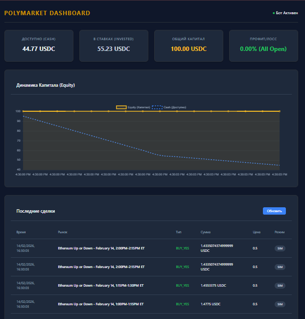

# Polymarket Discrepancy Trading Bot



This bot identifies discrepancies between Polymarket prices and real-world trends (crypto analytics, economic consensus) and executes trades when the divergence exceeds >15%.

## Core Goal: SURVIVAL

The bot is designed with a strong emphasis on capital preservation:

-   **Simulation Mode**: Enabled by default to test strategies risk-free.
-   **Risk Management**: Strictly limits position size to 1.5% of the portfolio per trade.
-   **Stop-Loss**: Automatically halts trading if the drawdown reaches 50% of the initial balance.
-   **Liquidity Filter**: Only trades in highly liquid binary (Yes/No) markets to ensure execution.

## How It Works

1.  **Scanner**: Scans Polymarket every 10 minutes for active, liquid markets.
2.  **Trend Analyzer**:
    *   **Crypto**: Compares live prices (via CoinGecko) against market targets to calculate probability trends.
    *   **Macro**: Utilizes consensus forecasts for macroeconomic events (e.g., Fed rates).
    *   **Extensiblity**: Easily add new data sources (News API, Google Trends) in `src/services/analyzer.js`.
3.  **Trader**: If the discrepancy is > 15%, the bot either logs a virtual trade (Simulation) or places a real order (LIVE mode).
4.  **Dashboard**: A local web interface (default port 3001) visualizes Equity, PnL, and active trades in real-time.

## Setup & Installation

1.  **Install Dependencies**:
    ```bash
    npm install
    ```
2.  **Configure Environment**:
    Copy `.env.example` to `.env` and configure your settings.
    *   For simulation, no API keys are required.
    *   If you are in a restricted region (e.g., Indonesia), the bot is configured to work without a VPN for market data (using CoinGecko and optimized headers).
3.  **Run Development Mode**:
    ```bash
    npm run dev
    ```
    This starts the bot with hot-reloading enabled.
4.  **Launch Dashboard**:
    ```bash
    npm run dashboard
    ```
    Open `http://localhost:3001` to view your performance.

## Going LIVE

To switch to real trading:

1.  Set `SIMULATION_MODE=false` in `.env`.
2.  Obtain your Polymarket API credentials:
    *   Export your Private Key from Polymarket Settings.
    *   Run `node src/generate-keys.js` (requires a proxy/VPN if in a restricted region) to get your API Key, Secret, and Passphrase.
    *   Add these to your `.env` file.
3.  Ensure your Polygon wallet has USDC.
4.  Restart the bot.

## Disclaimer

Trading on prediction markets involves high risk. Use this bot only with funds you can afford to lose. This software is provided "as is" for educational purposes.
